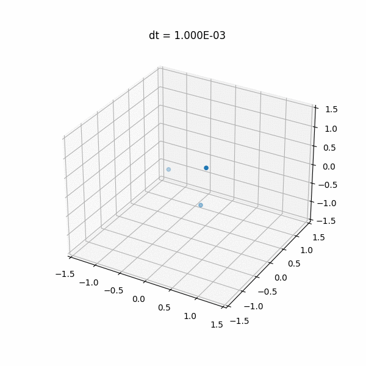

# Differential Equation Solver

This code is associated with a [presentation](https://github.com/gfloto/presentations) of differential equations and their relationship to modern machine learning algorithms (like diffusion models, continuous normalizing flow, neural odes etc). The script runs a basic simulation of the 3-body problem and renders the solution in real time in a 3D plot that can be rotated.

The solver uses a simple Euler update, that is a function of the minimum distance between two bodies. The idea here is that the solver needs to be more accurate in these instances, as the forces are stronger.

	

